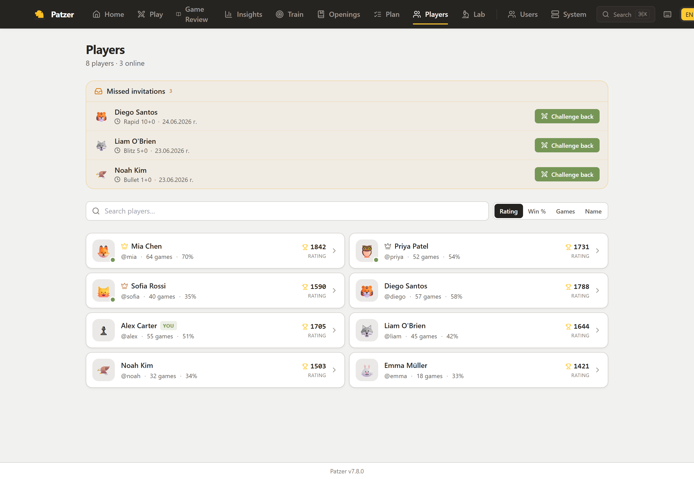
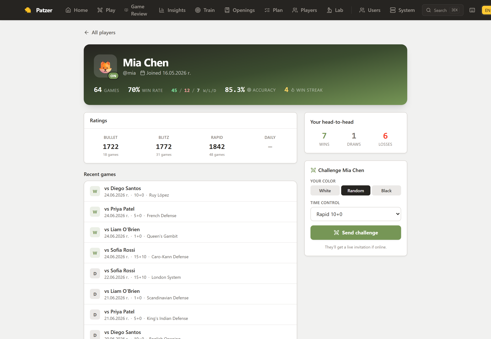
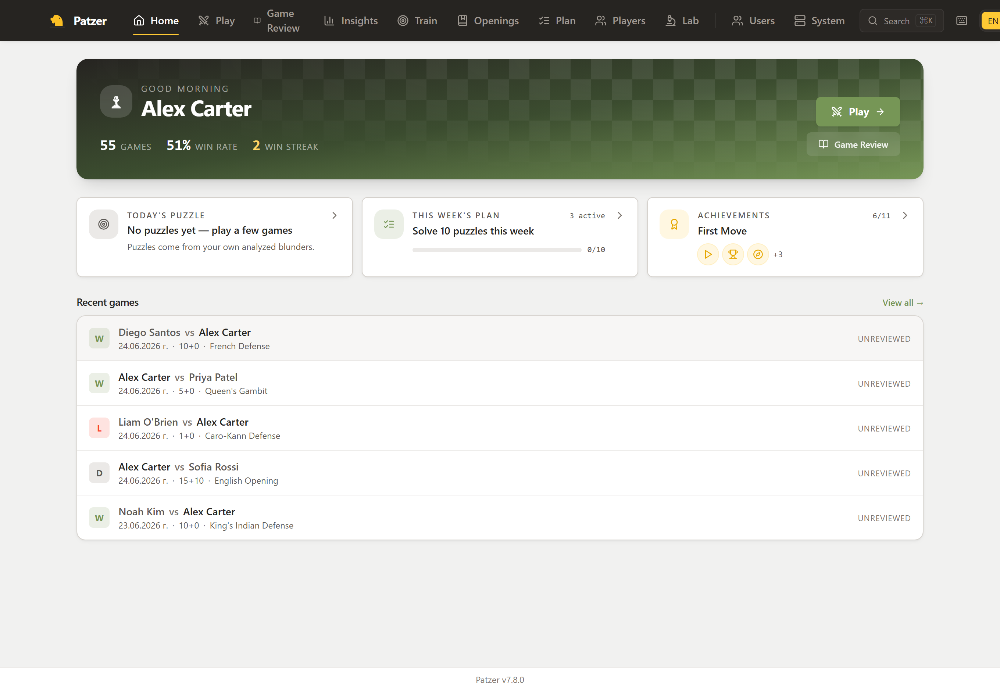
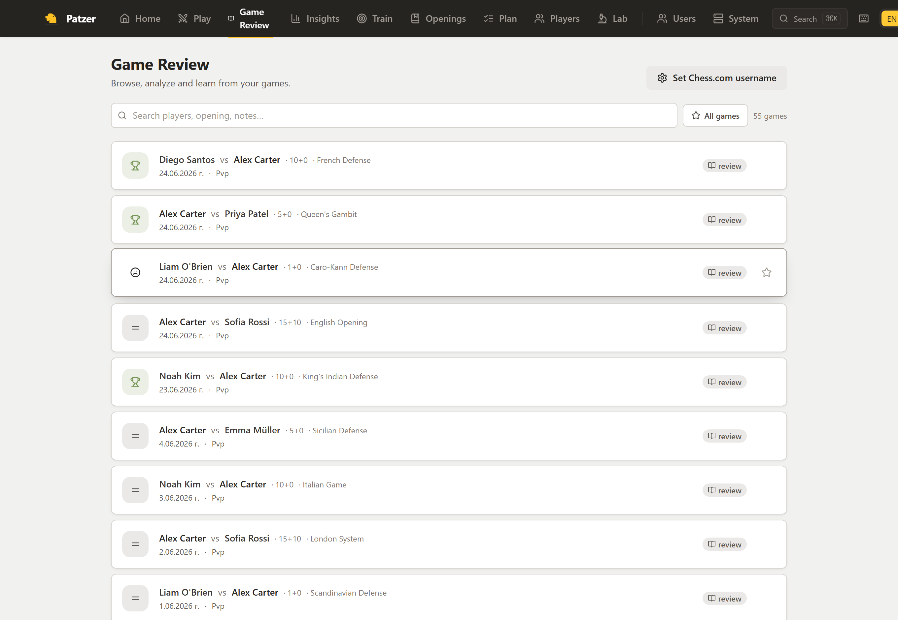
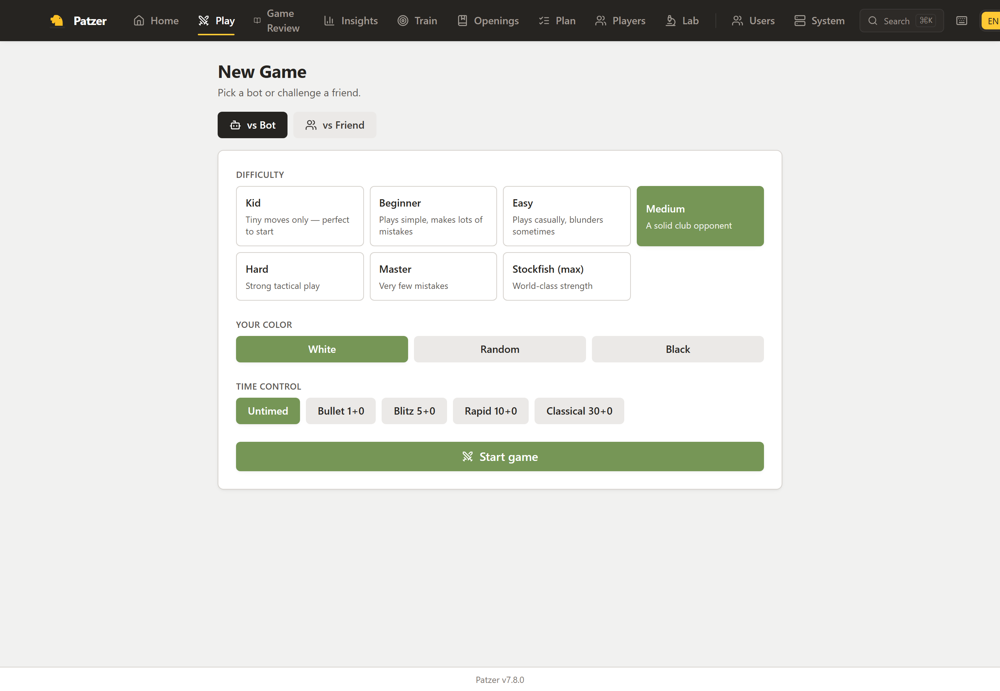
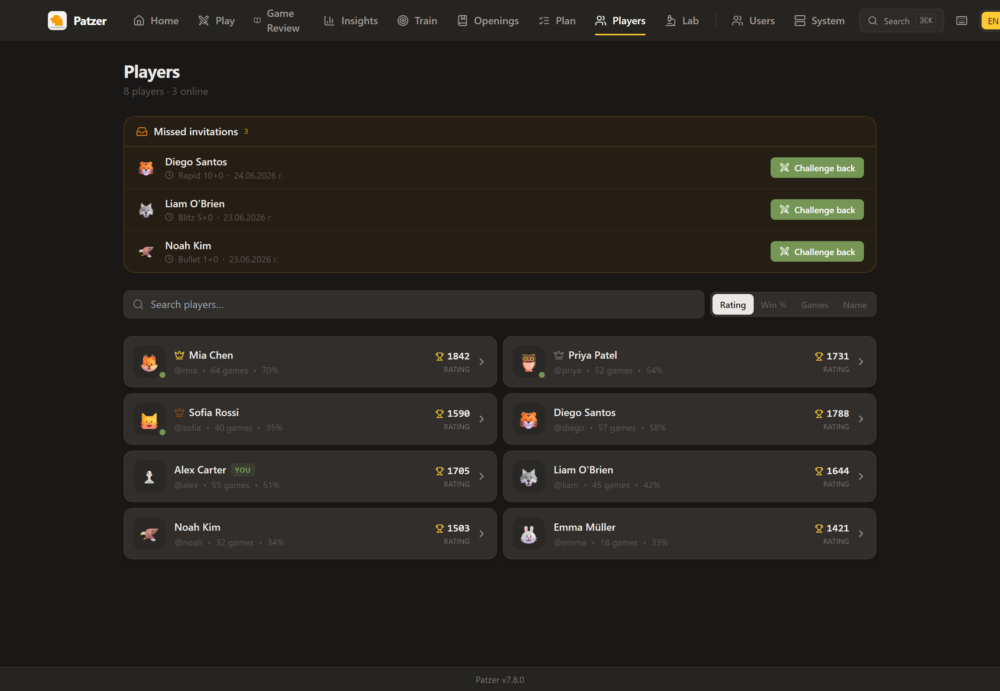
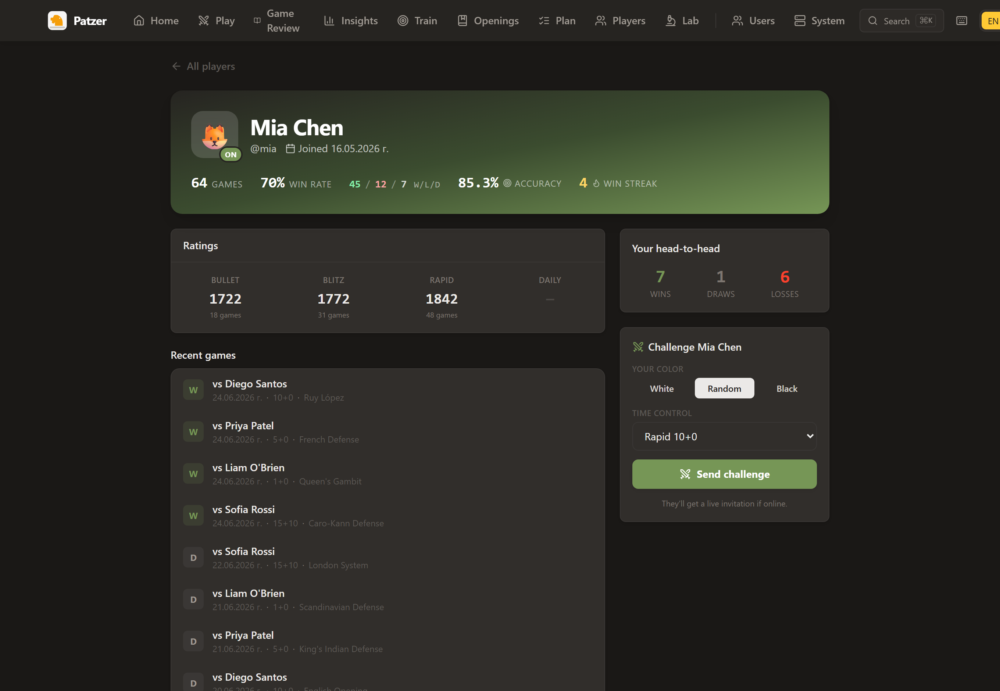

<p align="center">
  
</p>

<h1 align="center">Patzer</h1>

<p align="center">
  <b>Your private Chess.com.</b> Self-hosted, AI-coached, family-friendly.<br/>
  Stockfish + your own LLM, in one Docker container.
</p>

<p align="center">
  <a href="https://codespaces.new/SikamikanikoBG/patzer?quickstart=1">
    
  </a>
</p>

<p align="center">
  <a href="https://github.com/SikamikanikoBG/patzer/releases"></a>
  <a href="https://github.com/SikamikanikoBG/patzer/pkgs/container/patzer"></a>
  <a href="LICENSE"></a>
  <a href="https://github.com/SikamikanikoBG/patzer/actions/workflows/ci.yml"></a>
  <a href="https://github.com/SikamikanikoBG/patzer/stargazers"></a>
</p>

<p align="center">
  
  <br/>
  <sub><b>Players directory</b> — browse everyone on your server, sorted by rating, with live presence and missed invitations. <i>All accounts shown are demo data.</i></sub>
</p>

## Why Patzer

- **Your games stay home.** Single Docker container on a Pi / NAS / old laptop. No cloud, no telemetry, no upsell.
- **Bring your own LLM.** The AI coach runs against your own [Ollama](https://ollama.com) host. The coach is render-only — chess facts are computed server-side by Stockfish + chess.js, so a small local model can't hallucinate moves or pieces.
- **Made for a household, not a stadium.** Multi-user with admin console, per-profile language, kid-mode blunder warnings, "horsey" piece names for the youngest profiles.

## What it is

Patzer is a tiny, self-hosted take on the Chess.com / Lichess workflow you actually use:

- **Game Review** — pull your public Chess.com games, analyze with bundled Stockfish, get Lichess-style classifications (Best / Excellent / Good / Inaccuracy / Mistake / Blunder / Brilliant / Miss), accuracy %, eval graph, mistake markers.
- **Play vs Bot** — full games against Stockfish at seven named tiers (Kid → Stockfish max), all standard time controls, premoves enabled, kid-mode blunder warnings.
- **Play vs Friend** — real-time PvP between profiles on the same server over WebSocket.
- **Players & profiles** — a directory of everyone on your server with a rating leaderboard, live presence and public profiles (record, per-time-class ratings, your head-to-head), challenge-from-profile, and a "missed invitations" rail.
- **AI Coach (your LLM)** — point at any [Ollama](https://ollama.com) host. Audience-tuned voices for Kid / Beginner / Intermediate / Advanced. Anti-hallucination by design — chess facts are computed server-side; the LLM only renders them.
- **Family-ready** — multi-user with admin console, per-profile language, kid-mode blunder warnings, "horsey" piece names for the youngest profiles.
- **Multilingual** — EN + BG out of the box, UI *and* coach prompts. PRs for more languages welcome.
- **Self-hosted, single container** — runs on a Pi, a NAS, an old laptop. Your games never leave home.

## Screenshots

<table>
<tr>
<td width="50%" valign="top">

<br/><sub><b>Player profile</b> — lifetime record, per-time-class ratings, your head-to-head, and a one-click challenge.</sub>
</td>
<td width="50%" valign="top">

<br/><sub><b>Home</b> — your stats, today's puzzle, this week's plan, achievements and recent games.</sub>
</td>
</tr>
<tr>
<td width="50%" valign="top">

<br/><sub><b>Game Review</b> — every game, searchable, one tap to the Stockfish analyzer.</sub>
</td>
<td width="50%" valign="top">

<br/><sub><b>Play</b> — seven Stockfish tiers, all time controls, or a live challenge to a friend.</sub>
</td>
</tr>
</table>

Dark mode is built in (auto / light / dark, per profile):

<table>
<tr>
<td width="50%" valign="top"></td>
<td width="50%" valign="top"></td>
</tr>
</table>

<sub>All screenshots use anonymized demo data — no real accounts or hostnames.</sub>

## First run in five minutes

Pick **one** of these. The Docker options open <http://localhost:8800>; the Codespaces option opens in your browser. Either way, the first visit walks you through a setup wizard.

**Try it in your browser**

[](https://codespaces.new/SikamikanikoBG/patzer?quickstart=1)

Spins up a temporary Codespace with Patzer + Stockfish pre-installed. Wait ~60 seconds for `npm install` + dev server to start, then click the forwarded port labelled *"Patzer (Vite dev — open this)"*. You get the full app **except** the AI Coach narration (which needs an Ollama host on your network — see below).

**`docker run`**

```bash
docker run -d \
  -p 8800:8800 \
  -v patzer-data:/app/data \
  --name patzer \
  ghcr.io/SikamikanikoBG/patzer:latest
```

**`docker compose`**

```yaml
services:
  patzer:
    image: ghcr.io/SikamikanikoBG/patzer:latest
    container_name: patzer
    restart: unless-stopped
    ports:
      - "8800:8800"
    volumes:
      - patzer-data:/app/data
volumes:
  patzer-data:
```

> **What works without any extras:** play vs Stockfish, play vs friend on the same server,
> move classification, accuracy %, eval graph, opening detection. The setup wizard takes you
> straight to a working board.
>
> **What needs Ollama:** the AI Coach commentary voice. Until you point Patzer at an Ollama
> host, the *Coach* panel just shows the engine facts in plain text.
>
> **What needs a Chess.com username:** importing your public games for review. Without it
> you can still load PGNs by paste or play live and review from the move list.

You'll want, optionally:

- **For the AI Coach:** an [Ollama](https://ollama.com) server reachable from the Patzer container. The wizard validates the URL and lists available models for you. Patzer accepts loopback / RFC1918 / `*.local` Ollama hosts only — public-Internet model proxies aren't supported here.
- **For Game Review on your own games:** a Chess.com username (entered later in *Settings*).

To use a different host port, run with `-p 9000:8800` (or set `HOST_PORT=9000` if you're using `docker compose`).

If you're terminating TLS at a reverse proxy, set `COOKIE_SECURE=true` in the container's environment so session cookies aren't shipped over plaintext HTTP.

## Compared to alternatives

|                        | Patzer | Lichess Studio | Chess.com Review | Aimchess |
| ---------------------- | :----: | :------------: | :--------------: | :------: |
| Self-hosted            |   ✅   |       ❌        |        ❌         |    ❌    |
| LLM coach (BYO model)  |   ✅   |       ❌        |        ❌         |    ❌    |
| Imports Chess.com      |   ✅   |       ❌        |        ✅         |    ✅    |
| Multi-user / family    |   ✅   |       ❌        |        ❌         |    ❌    |
| Multilingual coach     |   ✅   |  partial UI    |        ❌         |    ❌    |
| Free                   |   ✅   |       ✅        |        💳         |    💳    |

## How it's built

```
┌────────────────────────── one Docker container ───────────────────────────┐
│                                                                            │
│  ┌──────────────┐   HTTP / WS   ┌────────────────────────────────────┐    │
│  │  Browser     │ ◀───────────▶ │ Hono server (Node, TypeScript)     │    │
│  │  React + Vite│               │  ├─ /api/auth, /games, /analyze… │    │
│  │  Tailwind    │               │  ├─ /ws/play   (live games)       │    │
│  │  chessground │               │  └─ /ws/lobby  (challenges)       │    │
│  └──────────────┘               └────────┬───────────────┬───────────┘    │
│                                          │               │                │
│                              UCI         ▼               ▼  HTTP          │
│                          ┌──────────┐         ┌────────────────┐         │
│                          │ Stockfish│         │ Ollama (your   │         │
│                          │ (native) │         │ machine, LAN)  │         │
│                          └──────────┘         └────────────────┘         │
│                                          │                                │
│                                          ▼                                │
│                                  ┌──────────────┐                         │
│                                  │   SQLite     │   (volume: /app/data)   │
│                                  └──────────────┘                         │
└────────────────────────────────────────────────────────────────────────────┘
```

The coach is render-only: every prompt is built from a pre-computed fact list (piece inventory, captured pieces, recent moves in plain English, in-check flag, engine PV) and the LLM is forbidden from inventing moves or pieces. See [server/src/coach/prompts.ts](server/src/coach/prompts.ts) and the [CHANGELOG 2.1.0 entry](CHANGELOG.md) for the why.

## Local development

Requirements: Node.js ≥ 20.11.

```bash
git clone https://github.com/SikamikanikoBG/patzer.git
cd patzer
npm install
# Windows: download Stockfish into ./bin/
npm run setup
# Linux/macOS: install Stockfish via your package manager
#   apt install stockfish    /    brew install stockfish

npm run dev
```

- Server: <http://localhost:8800>
- Vite dev server (HMR): <http://localhost:5173> — proxies `/api` and `/ws` to the server.

Useful scripts:

```bash
npm run typecheck   # tsc -b across server + web (no emit)
npm run build       # production build of both workspaces
```

## Deploying to a home server

Two equivalent scripts are bundled — `deploy.ps1` for Windows hosts,
`deploy.sh` for Linux / macOS hosts. Both tar the source, scp it to the
target, then run `docker compose build && up -d` over SSH.

Create `.env.deploy` (gitignored) on the workstation you're deploying *from*:

```
HOST=user@192.168.x.x
REMOTE_DIR=/home/user/patzer
SUDO_PASS=... # only if your user is not in the docker group on the target
HOST_PORT=8800
```

Then:

```powershell
# Windows
.\deploy.ps1            # tar source → ssh, build & start
.\deploy.ps1 -NoBuild   # restart without rebuilding
.\deploy.ps1 -Logs      # tail logs after deploy
```

```bash
# Linux / macOS
./deploy.sh             # tar source → ssh, build & start
./deploy.sh --no-build  # restart without rebuilding
./deploy.sh --logs      # tail logs after deploy
```

## Configuration

All user-facing configuration is done **through the UI** and persisted in SQLite. The only environment variables are operational:

| Var | Default | What it does |
|---|---|---|
| `PORT` | `8800` | HTTP listen port |
| `HOST` | `0.0.0.0` | Bind address |
| `DB_PATH` | `./data/chess.db` | SQLite database file |
| `STOCKFISH_PATH` | (auto) | Override Stockfish binary path |
| `SESSION_SECRET` | (auto-generated) | Cookie signing secret. Persisted on first run. |
| `COOKIE_SECURE`  | `false` | Set to `true` when terminating TLS at a reverse proxy so session cookies are flagged `Secure`. |

System settings (Ollama URL, default coach model, Stockfish path override) live in *Admin → System*.
Per-profile settings (language, audience, coach behavior, TTS voice, Chess.com username) live in *Settings*.

## How move classification works

Each played move is compared against the engine's best move at the same position. We compute the **win-percentage drop** using the Lichess sigmoid (`100 / (1 + exp(-0.00368208 · cp))`) and combine it with real centipawn loss to classify:

| Classification | Win-% drop | Centipawn loss |
| --- | --- | --- |
| Best ★ | < 0.5 | < 8 (or engine's #1) |
| Excellent ✓ | < 2 | < 25 |
| Good · | < 5 | < 60 |
| Inaccuracy ?! | < 10 | — |
| Mistake ? | < 20 | — |
| Blunder ?? | ≥ 20 | — |

`Brilliant` (`!!`) fires on calculated sacrifices that keep a winning eval; `Miss` flags blunders that gave away a winning advantage. Per-game accuracy is the harmonic-friendly Lichess formula `103.1668 · exp(-0.04354 · Δwin%) - 3.1669`, clamped to `[0, 100]`.

Estimated Elo is calibrated against published Lichess/Chess.com ACPL-vs-rating data — ACPL ~5 → 2700+, ACPL 30 → ~1900, ACPL 80 → ~1200. Accuracy nudges this ±200 Elo at most.

## Tech

- **Server:** Node 20 · TypeScript · [Hono](https://hono.dev) · [better-sqlite3](https://github.com/WiseLibs/better-sqlite3) · [chess.js](https://github.com/jhlywa/chess.js) · `ws` · native [Stockfish](https://stockfishchess.org/)
- **Web:** React 18 · Vite · Tailwind CSS · [chessground](https://github.com/lichess-org/chessground) · framer-motion · react-i18next · TanStack Query
- **Coach:** [Ollama](https://ollama.com) (default model: `gemma3:1b`; recommend something larger like `qwen2.5:7b` for nicer voice)
- **TTS:** browser Web Speech API (uses installed OS voices)
- **Persistence:** single SQLite file in `./data/`

## Troubleshooting

- **"Stockfish binary not found"** — Patzer no longer falls back to a bare `stockfish` PATH lookup (defense-in-depth: a malicious binary earlier in `$PATH` would otherwise run as the server user). Either install Stockfish into `/usr/games/stockfish`, `/usr/local/bin/stockfish`, `/opt/homebrew/bin/stockfish`, or `bin/stockfish` in the project, or set `STOCKFISH_PATH` (env) / *Admin → System → Stockfish path*.
- **"Ollama unreachable" during setup** — Patzer's setup-time test endpoint only allows loopback / RFC1918 / `*.local` URLs. Use `http://host.docker.internal:11434` from inside Docker on Mac/Windows, or your LAN IP on Linux. After setup, change it any time in *Admin → System*.
- **Port 8800 already in use** — `-p 9000:8800` (docker run) or `HOST_PORT=9000 docker compose up -d`.
- **Lost your admin password** — there is no in-app reset yet. Until one ships, edit `chess.db` directly: open `data/chess.db` with `sqlite3` and replace the row's `password_hash` with a `bcryptjs` hash (cost ≥ 12).
- **Cookies dropped behind a reverse proxy** — see `COOKIE_SECURE=true` above. The cookie also requires the same hostname for both the page and the API.
- **PvP refresh ate my clock** — fixed in 3.1.0 (clocks + last-move timestamp now persist on every move). Earlier versions reset the time control on rehydration.

## More

- **[FAQ](docs/FAQ.md)** — what Patzer is and isn't, Chess.com API legality, NAT/proxy notes, backup, "I lost my admin password", language additions.
- **[Roadmap](ROADMAP.md)** — what's queued and what's deliberately out of scope.
- **[Changelog](CHANGELOG.md)** — every release, with why-not-just-what entries.

## Contributing

PRs welcome — please read [CONTRIBUTING.md](CONTRIBUTING.md) first. Translations especially encouraged.

## Security

See [SECURITY.md](SECURITY.md). For vulnerabilities, **don't** open a public issue — use [GitHub's private vulnerability reporting](https://github.com/SikamikanikoBG/patzer/security/advisories/new).

## License

MIT — see [LICENSE](./LICENSE). Note the GPL-3.0 components (chessground, Stockfish) — see [THIRD_PARTY_NOTICES.md](THIRD_PARTY_NOTICES.md).
